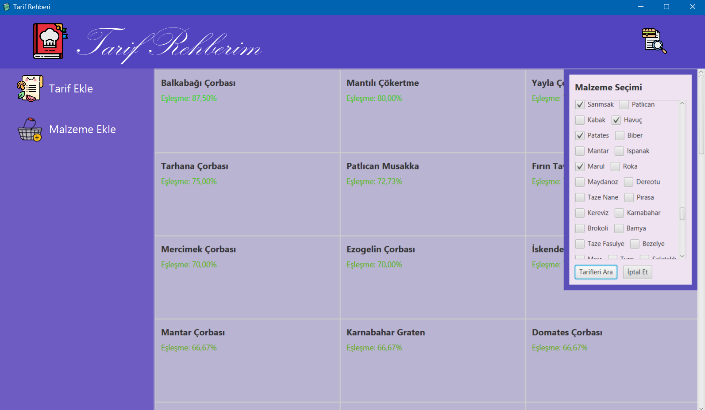

# Tarif Rehberi

## Özet 

Bu proje, kullanıcıların yemek tariflerini
kaydedip yönetebileceği ve mevcut malzemelerine
göre hangi yemeklerin yapılabileceğini gösteren bir
masaüstü uygulaması geliştirmeyi amaçlamaktadır.
Uygulama, veritabanı yönetimi, dinamik arama,
filtreleme ve kullanıcı dostu bir arayüz tasarımını
içermektedir. Kullanıcı, tarifleri ekleyebilir,
güncelleyebilir veya silebilir ve mevcut
malzemelerine göre yapılabilecek tarif önerilerini
görüntüleyebilir. Proje kapsamında, tariflerin ve
malzemelerin saklanması için veritabanı tasarımı
SQLite ile yapılmış, Java programlama diliyle ve
JavaFX kütüphanesiyle uygulama
geliştirilmiştir.Veritabanı normalizasyonu
uygulanmış ve dinamik arama algoritmaları
geliştirilmiştir.

## Ekran Görüntüleri 

### Ana Sayfa

### Arama

### Detay

### Filtre

### Maliyet Gosterimi

### Malzeme Secimi

### Siralama

### Tarif Arama

